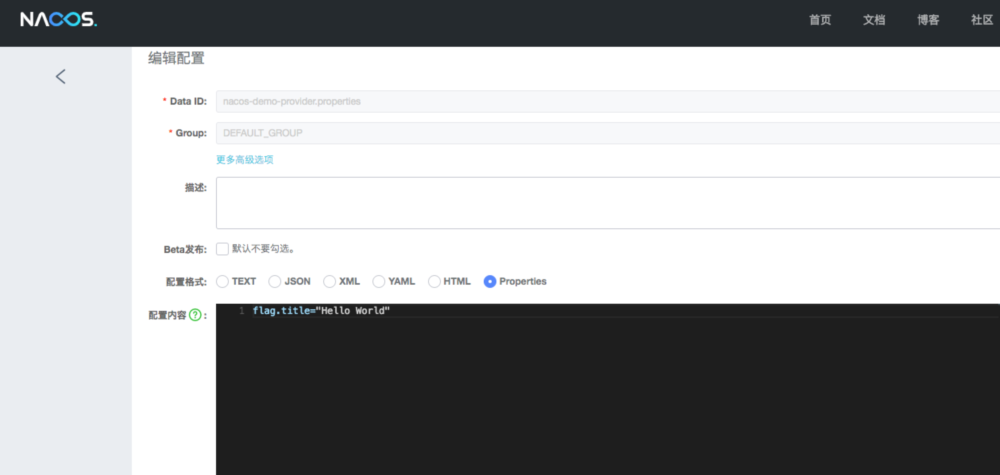

## Run Nacos config 前须知
run  nacos-discovery 前需要两步, 0基础都能上手

### 1.在 Nacos 配置管理 添加配置记录 
> 
>

### 2.访问服务
> 将 bootstrap.properties -> 改变为你的Nacos地址 spring.cloud.nacos.discovery.server-addr= nacos-ip+port
> 
> 后启动当前 服务 
>
> http://localhost:9919/echo/123
>
> 在 Nacos 控制台 修改配置记录 后刷新

### 原理解释
#### dataID
  
  在 Nacos Config Starter 中，dataId 的拼接格式如下
  
  	${prefix} - ${spring.profiles.active} . ${file-extension}
  
  * `prefix` 默认为 `spring.application.name` 的值，也可以通过配置项 `spring.cloud.nacos.config.prefix`来配置。
  
  * `spring.profiles.active` 即为当前环境对应的 profile，详情可以参考 [Spring Boot文档](https://docs.spring.io/spring-boot/docs/current/reference/html/boot-features-profiles.html#boot-features-profiles)
  
  	**注意，当 activeprofile 为空时，对应的连接符 `-` 也将不存在，dataId 的拼接格式变成 `${prefix}`.`${file-extension}`**
  
  * `file-extension` 为配置内容的数据格式，可以通过配置项 `spring.cloud.nacos.config.file-extension`来配置。
  目前只支持 `properties` 类型。
  
  #### group
  * `group` 默认为 `DEFAULT_GROUP`，可以通过 `spring.cloud.nacos.config.group` 配置。
  
  
  ### 自动注入
  Nacos Config Starter 实现了 `org.springframework.cloud.bootstrap.config.PropertySourceLocator`接口，并将优先级设置成了最高。
  
  在 Spring Cloud 应用启动阶段，会主动从 Nacos Server 端获取对应的数据，并将获取到的数据转换成 PropertySource 且注入到 Environment 的 PropertySources 属性中，所以使用 @Value 注解也能直接获取 Nacos Server 端配置的内容。
  
  ### 动态刷新
  
  Nacos Config Starter 默认为所有获取数据成功的 Nacos 的配置项添加了监听功能，在监听到服务端配置发生变化时会实时触发 `org.springframework.cloud.context.refresh.ContextRefresher` 的 refresh 方法 。
  		
  如果需要对 Bean 进行动态刷新，请参照 Spring 和 Spring Cloud 规范。推荐给类添加 `@RefreshScope` 或 `@ConfigurationProperties ` 注解，
  
  更多详情请参考 [ContextRefresher Java Doc](http://static.javadoc.io/org.springframework.cloud/spring-cloud-context/2.0.0.RELEASE/org/springframework/cloud/context/refresh/ContextRefresher.html)
  
  	
## Run Nacos discovery 前须知
run  nacos-discovery 前需要三步，0基础都能上手

### 1. nacos-server 服务配置
> 1.1 保证你的Nacos服务器能正常访问被访问
>
> 1.2 将 bootstrap.properties -> 改变为你的Nacos地址 spring.cloud.nacos.discovery.server-addr= nacos-ip+port

### 2. 生产消费双启动
> 2.1 启动 provider -> 将 bootstrap.properties -> 改变为 spring.profiles.active=provider 
> 
>启动 NacosProviderApplication  的 run方法
>
> 2.2 启动 consumer -> 将 bootstrap.properties -> 改变为 spring.profiles.active=consumer 
>启动 NacosConsumerApplication  的 run方法
>
> 2.3 打开 Nacos 控制台
> 
### 3. 访问服务
> 
> http://localhost:9819/echo/899687674532357678978989
>
> Hello Nacos Discovery 899687674532357678978989
