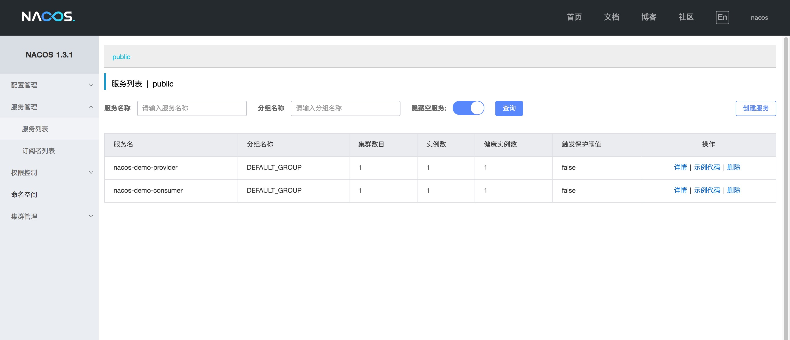

## Run 前须知
run 这个 nacos-demo 只需要三步, 0基础都能上手

### 1. nacos-server 服务配置
> 1.1 保证你的Nacos服务器能正常访问被访问
>
> 1.2 将 bootstrap.properties -> 改变为你的Nacos地址 spring.cloud.nacos.discovery.server-addr= nacos-ip+port

### 2. 生产消费双启动
> 2.1 启动 provider -> 将 bootstrap.properties -> 改变为 spring.profiles.active=provider 
> 
>启动 NacosProviderApplication  的 run方法
>
> 2.2 启动 consumer -> 将 bootstrap.properties -> 改变为 spring.profiles.active=consumer 
>启动 NacosConsumerApplication  的 run方法
>
> 2.3 打开 Nacos 控制台
> 
### 3. 访问服务
> 
> http://localhost:9819/echo/899687674532357678978989
>
> Hello Nacos Discovery 899687674532357678978989
